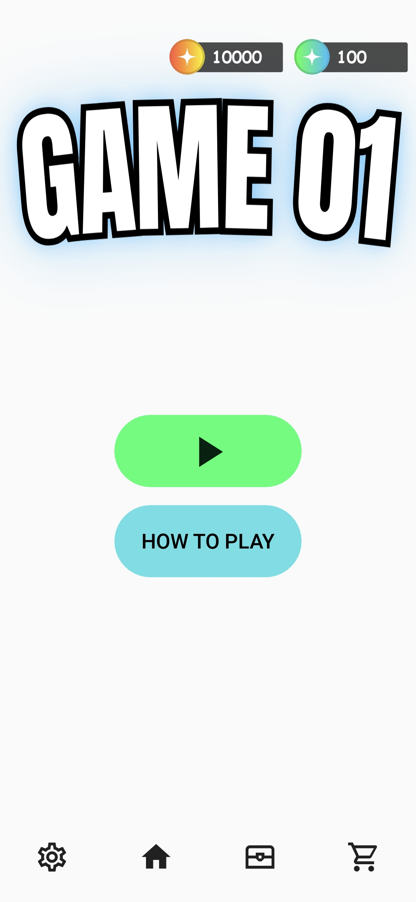
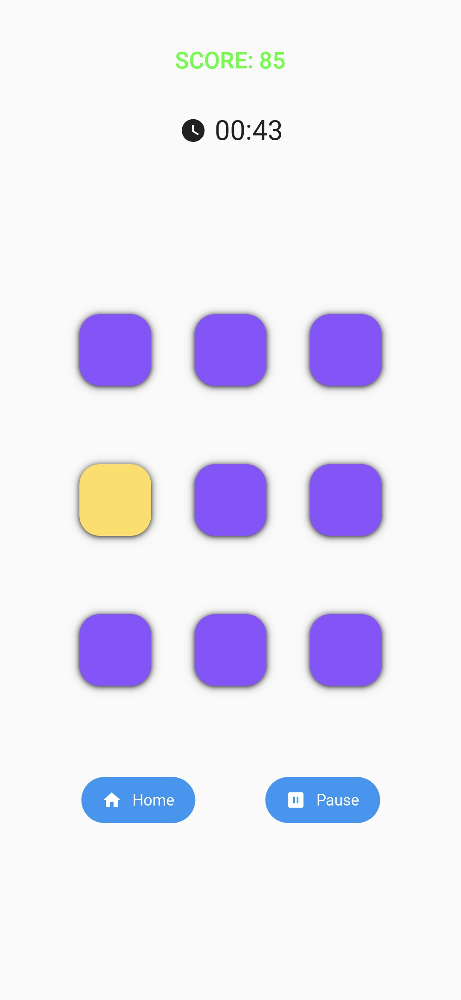
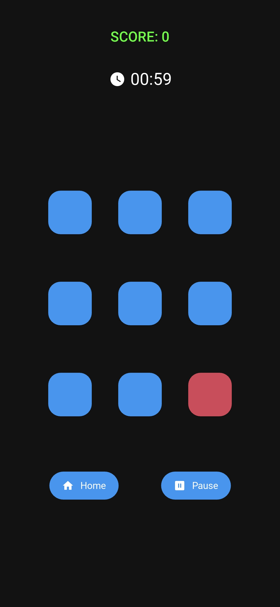
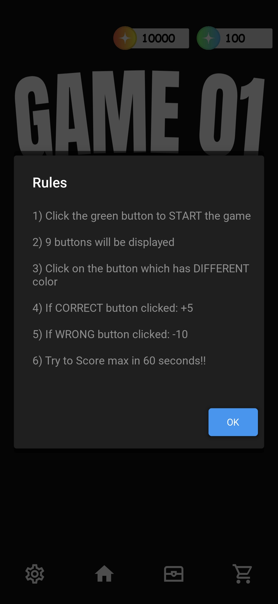
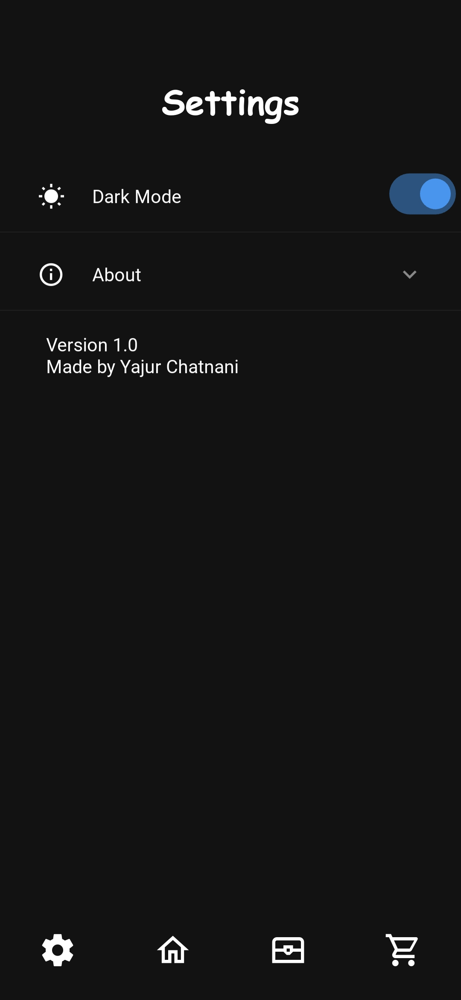
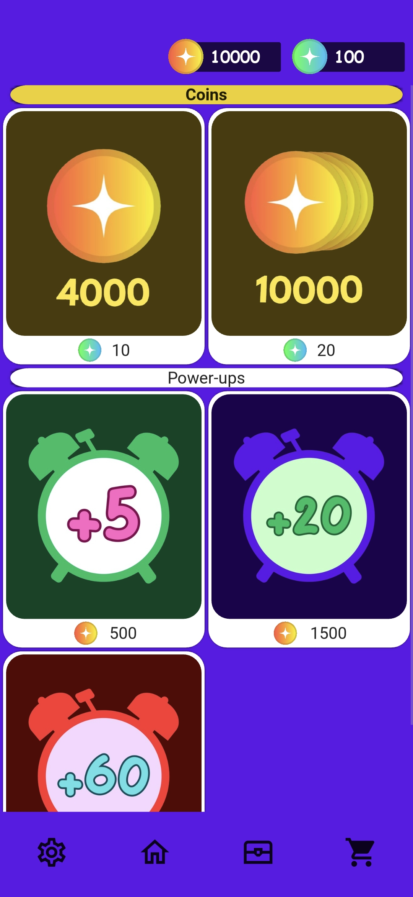

# 🎮 GAME 01 – Reflex Color Tap Challenge

**GAME 01** is a fast-paced mobile game built using **Python** and **KivyMD**, where your goal is to tap the button with the **different color** among a 3x3 grid. React fast, score high, and unlock rewards!

> ⏱ Score as high as you can in 60 seconds!

---

## 🧠 Gameplay Rules

1. Tap the **green play button** to start the game  
2. A grid of 9 buttons will appear  
3. One button has a slightly different color — tap that!  
4. ✅ Correct tap = **+5 points**  
   ❌ Wrong tap = **-10 points**  
5. Your goal: Get the highest score in **60 seconds**

---

## 🖼️ Screenshots

| Home Screen | Gameplay (Light) | Gameplay (Dark) |
|-------------|------------------|-----------------|
|  |  |  |

| Rules Popup | Settings | Store |
|-------------|----------|--------|
|  |  |  |

> 🌗 Light and Dark mode support included

---

## 🎥 Watch Demo

> [](https://youtube.com/shorts/5eTq8zv1KKw?si=FChnyr47CWxNvEFS)


---

## 🚀 Features

- ✅ 60-second reflex challenge
- ✅ Unique color detection logic
- ✅ Timer, Score & High Score tracking
- ✅ Pause / Resume functionality
- ✅ In-game coin and s-coin system
- ✅ Store & Missions (expandable)
- ✅ Light / Dark mode toggle
- ✅ Responsive KivyMD UI layout

---

## 🛠️ Tech Stack

- **Language:** Python  
- **Framework:** KivyMD (on top of Kivy)  
- **Tools:** VS Code, Git, Python 3.x

---

## 📂 Installation & Running

> 💡 This app is optimized for mobile, but can be tested on desktop.

1. **Clone this repository:**
   ```bash
   git clone https://github.com/YajurChatnani/game01.git
   cd game01
   
2. **(Optional) Create and activate a virtual environment:**
   ```bash
   python -m venv venv
   source venv/bin/activate  # On Windows: venv\Scripts\activate

3. **Install required dependencies:**
   ```bash
   pip install kivy kivymd

4. **Run the app:**
   ```bash
   python main.py

